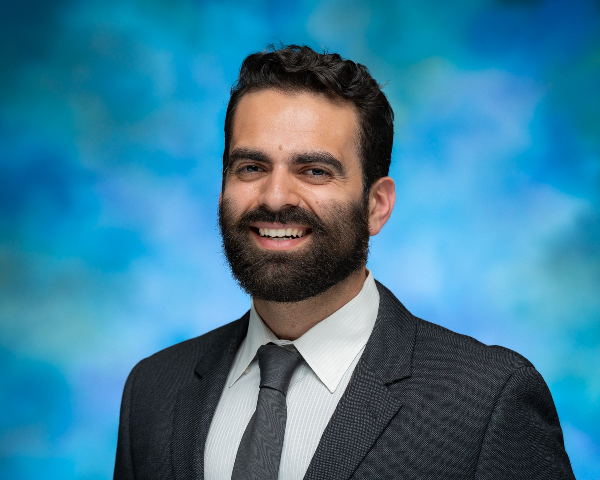

**Ph.D. Candidate**  
Department of Political Science  
University of California, Davis

## Bio

I’m a fifth-year Ph.D. candidate in Political Science at UC Davis, where I study how AI and automation are reshaping political attitudes toward redistribution, regulation, and the welfare state. My research combines survey experiments, cross-national analysis, and occupational risk data to understand how economic shocks influence political preferences.

In 2017 realized I loved teaching undergraduates how politics shapes their world, while leading discussion sections at UC San Diego and completing my Master of International Affairs. I now have nine years of experience in undergraduate teaching, mentorship, and pedagogical development. I have served as instructor of record for courses in American politics, comparative politics, and international relations. In political theory, I have taught hundreds of discussion sections on Mesoamerican Political Thought, Plato, Confucius, Hobbes, and more.  My teaching emphasizes inclusive pedagogy and active learning. At UC Davis, I served as a Teaching Assistant Consultant, providing one-on-one consultations and leading workshops on Universal Design for Learning, supporting multilingual learners, and integrating technology into the classroom.

My dissertation explores how welfare state generosity shapes political responses to automation across countries, helping explain why similar disruptions provoke upheaval in some contexts but not in others. Latin America, with its varied welfare regimes and histories of populism, is a central focus. I am also interested in how different intellectual traditions, such as  pre-colonial Indigenous thought and Confucianism, influence modern debates over the role of the state in the economy

Even outside of explicitly comparative courses, I bring a global lens to the classroom. For example, students in my theory sections engage with texts such as the Analects of Confucius and pre-colonial Mesoamerican sources on the Aztec state alongside the Western canon.

## Education

- **Ph.D. Political Science | First Field: Comparative Politics, Second Field: Political Theory** | UC Davis, expected 2026  
- **Master of International Affairs | Career Tracks: International Economics and Business | Regional Focus Latin America** - UC San Diego, 2018
- **B.A. History and International Studies** - UC San Diego, 2016

## Research Interests

Political economy of AI | Welfare State Policy | Survey experiments | Latin America | Comparative Political Philosophy of Redistribution
